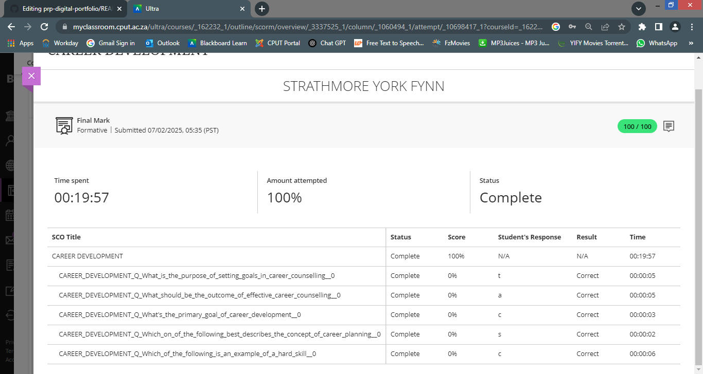
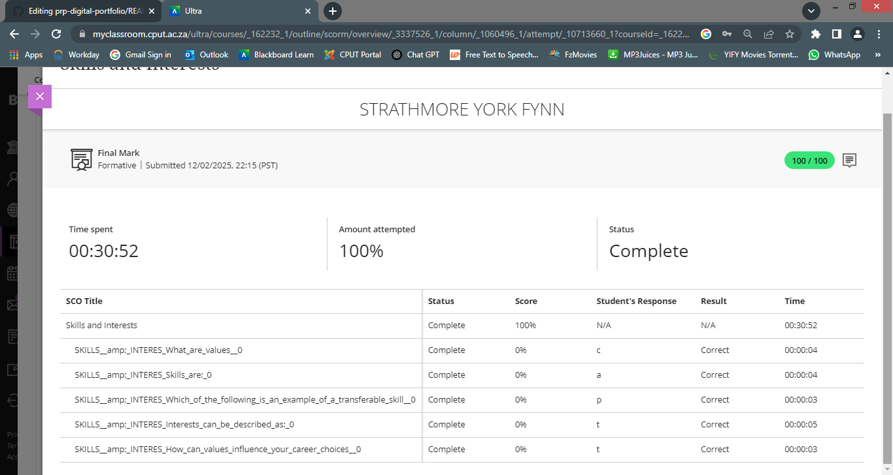
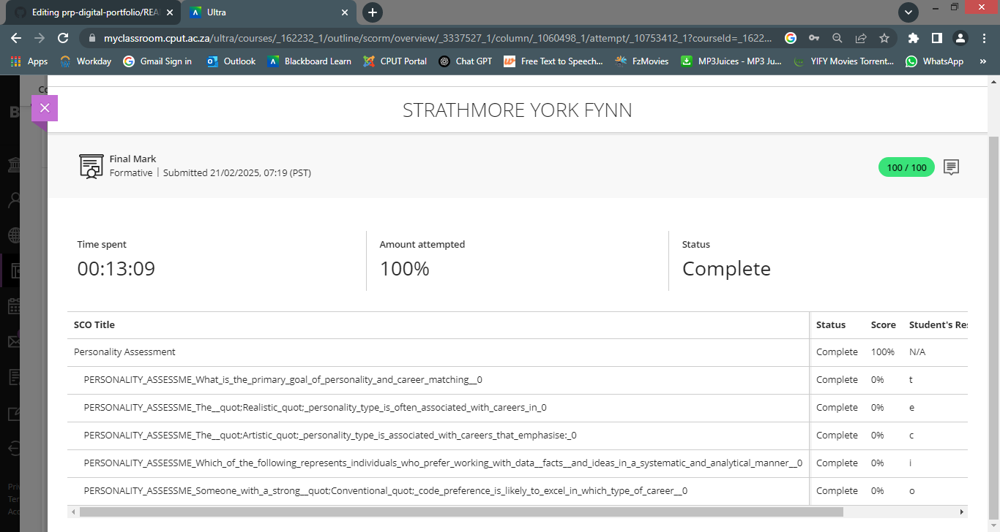
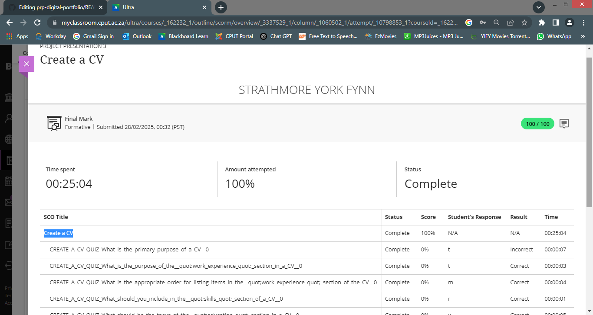
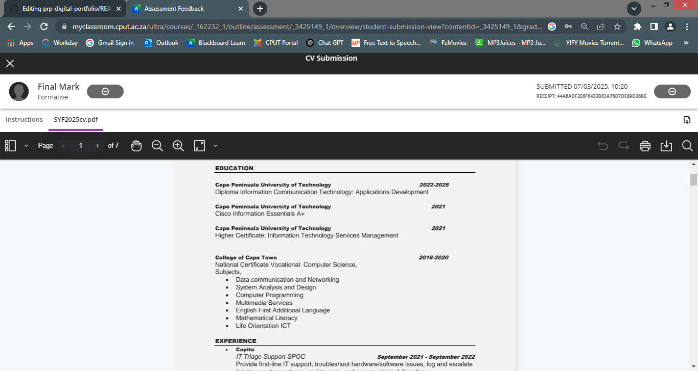

# prp-digital-portfolio
🌟 STAR Reflections – PRP370 Digital Portfolio

---

## 🧭 Career Counselling – Reflection (STAR)

**🎯 Situation**  
I needed guidance on my career direction in the ICT field.

**📝 Task**  
Attend a counselling session and complete a career assessment.

**⚙️ Action**  
I scheduled a session, completed a personality-career match test, and discussed results with a career advisor.

**✅ Result**  
I gained insight into software development, network security, and business analysis as viable options. This helped clarify my study and job application goals.

---

## 💡 Skills & Interests – Reflection (STAR)

**🎯 Situation**  
I wasn’t sure which technical skills to focus on.

**📝 Task**  
Identify my strongest skills and interests for career alignment.

**⚙️ Action**  
Took a coding skills test, reviewed past project feedback, and made a strengths list.

**✅ Result**  
Discovered my interest in front-end development and strong problem-solving skills. Decided to specialize in full-stack development.

---

## 🧠 Personality Assessment – Reflection (STAR)

**🎯 Situation**  
I wanted to understand how my personality affects my work and team dynamics.

**📝 Task**  
Complete a personality assessment and reflect on the outcomes.

**⚙️ Action**  
Took the MBTI test, researched the meaning of the results, and reviewed past team experiences.

**✅ Result**  
Realized I enjoy solving complex problems and prefer independent tasks. I now look for roles that match this personality type.

---

## 📄 CV Creation – Reflection (STAR)

**🎯 Situation**  
I needed a professional CV for internship applications.

**📝 Task**  
Create and format a CV that highlights my education, skills, and experience.

**⚙️ Action**  
Used a CV template and customized it with Markdown. Reviewed it against internship requirements.

**✅ Result**  
Created a clean, concise CV. Received feedback from peers and updated it accordingly.

---

## 📤 CV Submission – Reflection (STAR)

**🎯 Situation**  
I applied for a software internship to gain experience.

**📝 Task**  
Prepare and submit my CV to relevant opportunities.

**⚙️ Action**  
Tailored my CV, proofread it, and submitted it through a job portal and direct email.

**✅ Result**  
Received an acknowledgment from a company. Learned the importance of customizing applications for each opportunity.

---
